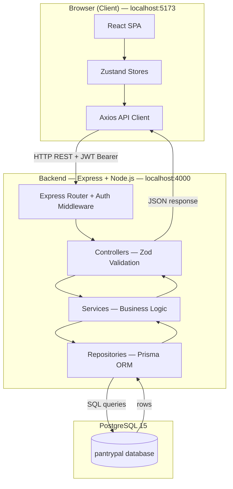
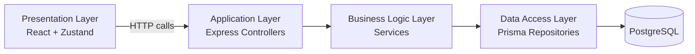
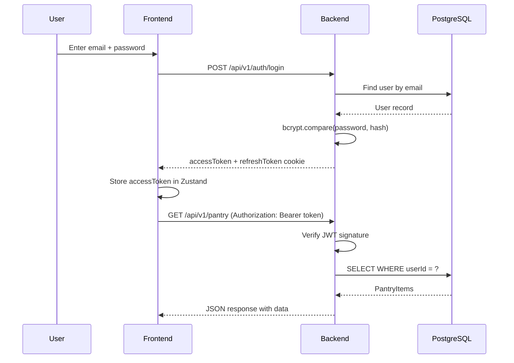
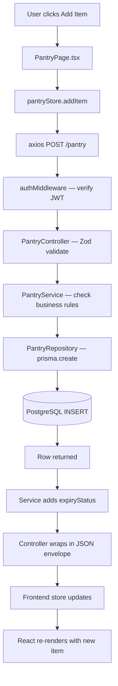

# Architecture Diagram — PantryPal

## High-Level System Overview

## Layered Architecture — Dependency Flow

Each layer only depends on the layer directly below it. The presentation layer never touches the database. The data access layer never knows about HTTP.

## Authentication Flow

## Request-Response Flow — Adding a Pantry Item

